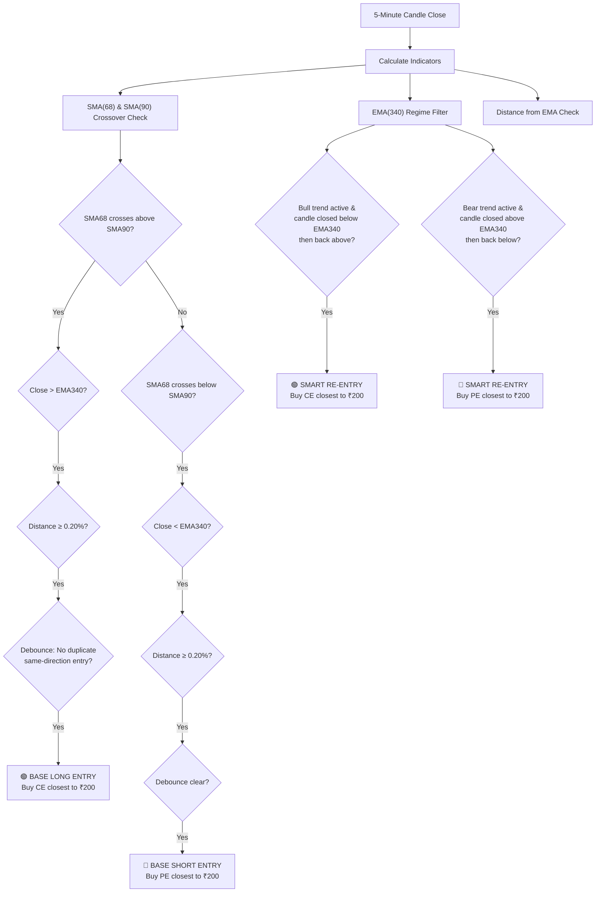
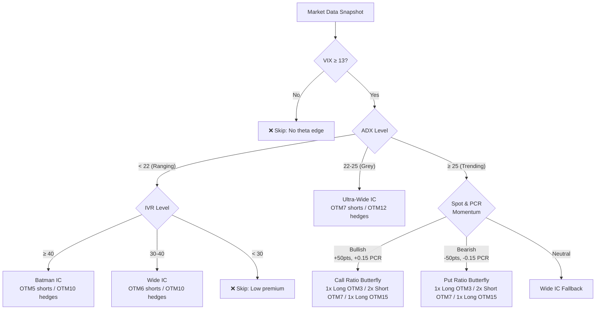
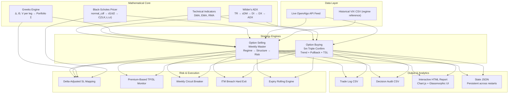

<p align="center">
  
  
  
  
  
</p>

<h1 align="center">Nifty Quant Suite</h1>
<p align="center"><b>A comprehensive quantitative options trading and backtesting platform for the Indian derivatives market (NSE Nifty 50)</b></p>

<p align="center">
  <i>Two production-grade algorithmic strategies spanning directional option buying and multi-leg option selling — unified under a single analytical framework with real-time Black-Scholes pricing, dynamic Greek risk management, and institutional-grade execution logic.</i>
</p>

---

## Table of Contents

- [Why Options Are Hard — The 7-Dimensional Data Problem](#why-options-are-hard--the-7-dimensional-data-problem)
- [Black-Scholes Modeling & Greek Risk Engine](#black-scholes-modeling--greek-risk-engine)
- [Strategy 1 — Option Buying: Nifty 5m Triple Confirm](#strategy-1--option-buying-nifty-5m-triple-confirm)
- [Strategy 2 — Option Selling: Nifty Weekly Master](#strategy-2--option-selling-nifty-weekly-master)
- [Capital Requirements & ROI Modeling](#capital-requirements--roi-modeling)
- [System Architecture](#system-architecture)
- [Project Structure](#project-structure)
- [Getting Started](#getting-started)

---

## Why Options Are Hard — The 7-Dimensional Data Problem

Equity backtesting operates in a relatively simple 2D space: **Time × Price**. You download a CSV of OHLC candles, loop through it, and you're done.

**Options are fundamentally different.** A single underlying index like Nifty generates thousands of derivative contracts simultaneously, each with its own price dynamics. Backtesting or trading options requires navigating a **7-dimensional data manifold** where every dimension interacts non-linearly with the others:

```
                    ┌─────────────────────────────────────────────────┐
                    │         OPTIONS PRICING MANIFOLD                │
                    │                                                 │
                    │   O(premium) = f(S, K, τ, σ, r, Bias, L)      │
                    │                                                 │
                    │   Where each dimension is a separate axis       │
                    │   of variation that must be tracked,            │
                    │   indexed, and priced simultaneously.           │
                    └─────────────────────────────────────────────────┘
```

| Dimension | Symbol | What It Represents | Engineering Challenge |
|:---|:---:|:---|:---|
| **Spot Price** | $S_t$ | Underlying Nifty index value ticking every second | Real-time feed ingestion; 5-minute OHLC aggregation across 75 intraday bars |
| **Strike Price** | $K$ | Discrete contracts every 50 points (e.g., 24000, 24050, ..., 25500) | Cross-sectional indexing: ~60 active strikes × 2 types = **120 contracts per expiry per timestamp** |
| **Time-to-Expiry** | $\tau = T - t$ | Non-linear theta decay — accelerates exponentially near expiry | Must compute $\tau$ in fractional years relative to exact expiry datetime (Tuesday 15:30 IST for Nifty weeklies) |
| **Volatility** | $\sigma$ | India VIX / implied volatility surface | Regime-dependent: VIX at 11 vs 22 produces completely different option prices for identical $(S, K, \tau)$ tuples |
| **Risk-Free Rate** | $r$ | Annualized interest rate (RBI repo rate ~6.5%) | Affects present-value discounting in Black-Scholes; relatively stable but must be parameterized |
| **Option Bias** | CE/PE | Call (bullish right) vs Put (bearish right) | Asymmetric delta curves: a CE and PE at the same strike have mirrored but non-identical Greeks |
| **Liquidity** | $L$ | Open Interest walls, bid-ask spreads, volume | Max Pain calculation requires full OI distribution; slippage modeling requires volume-weighted spread estimation |

### The Data Volume Explosion

For a single trading day on Nifty 5-minute candles:
- **Spot data**: 75 candles × 1 instrument = **75 rows**
- **Options data**: 75 candles × 60 strikes × 2 types (CE/PE) = **9,000 rows per expiry**
- **Multi-expiry**: Current week + next week = **~18,000 rows/day**
- **Annual dataset**: 250 trading days × 18,000 = **4.5 million rows/year**

This is a **120× data volume expansion** compared to spot-only backtesting. Our engines solve this through targeted **strike selection algorithms** — instead of loading all 120 contracts, our engines scan strikes dynamically to find the one whose LTP is closest to ₹200 (buying strategy) or within a ₹10-25 band (selling strategy), resolving the ATM strike instantly with `round(spot / 50) × 50`.

---

## Black-Scholes Modeling & Greek Risk Engine

At the core of every strategy in this suite is the **Black-Scholes-Merton pricing model**, implemented from scratch (no external pricing libraries) for full control over edge cases (zero DTE, deep ITM/OTM, zero-vol guards):

$$C(S, K, \tau, r, \sigma) = S \cdot N(d_1) - K \cdot e^{-r\tau} \cdot N(d_2)$$

$$d_1 = \frac{\ln(S/K) + (r + \sigma^2/2)\tau}{\sigma\sqrt{\tau}}, \quad d_2 = d_1 - \sigma\sqrt{\tau}$$

Where $N(\cdot)$ is the cumulative standard normal distribution (implemented via `math.erf`).

### Greeks Computed in Real-Time

| Greek | Formula | Usage in This Suite |
|:---:|:---|:---|
| **Delta** ($\Delta$) | $N(d_1)$ for calls; $N(d_1) - 1$ for puts | **Delta-adjusted stop loss mapping**: translates a 50-point spot SL into dynamic option premium SL via $\text{SL}_{\text{opt}} = \text{SL}_{\text{spot}} \times \Delta$ |
| **Theta** ($\Theta$) | $-\frac{S \cdot N'(d_1) \cdot \sigma}{2\sqrt{\tau}} - rKe^{-r\tau}N(d_2)$ ÷ 365 | Quantifies daily premium decay; drives the P&L engine for theta-harvesting selling strategies |
| **Vega** ($\mathcal{V}$) | $S \cdot N'(d_1) \cdot \sqrt{\tau}$ ÷ 100 | Measures sensitivity to India VIX changes; used for IVR-based regime filtering |

### Why Delta-Adjusted SL Matters

A naive approach sets a fixed stop loss on the option premium (e.g., "exit if premium drops 30%"). This fails because:

- **Near-expiry, low-delta options** can lose 30% of premium on a 10-point spot move
- **Far-from-expiry, high-delta options** might need a 100-point spot move to trigger the same 30% premium drop

Our engine instead anchors the SL on **spot points** and dynamically converts it:

```
Spot Entry: 24,500  |  Strike: 24,400 CE  |  Delta: 0.62
Spot SL: 50 points  →  Option SL: 50 × 0.62 = 31 premium points
```

This ensures the risk is always defined in terms of the underlying's movement, not the derivative's non-linear price action.

---

## Strategy 1 — Option Buying: Nifty 5m Triple Confirm

> **Engine**: [`option-buying/option_buying.py`](option-buying/option_buying.py) | **Logic Doc**: [`option-buying/strategy_logic.md`](option-buying/strategy_logic.md)

A **directional momentum strategy** that buys weekly Nifty Call or Put options (closest to ₹200 premium) on confirmed trend signals, with a two-phase spot-trailing stop loss.

### Signal Architecture



### Two-Phase Trailing Stop Loss

```
Phase 1 (Initial SL):  SL = Entry Spot ± 0.75%  (fixed, no trailing)
                        ↓
                        Profit reaches ≥ 0.75% on spot
                        ↓
Phase 2 (Trail Active): SL ratchets with candle high/low
                        Dynamic SL = Trail Peak × (1 - 0.75%)
                        SL can only move in favor, never against
```

### Key Engineering Details

- **Historical state synchronization**: On startup, the engine replays the last 5 days of candle history step-by-step to warm up all indicator values and detect if a trade should currently be active — no cold-start blind spots.
- **Candle-boundary execution**: The main loop fires exactly 2 seconds after each 5-minute candle close (`minute % 5 == 0, second in [0,5]`) to allow broker data feeds to settle.
- **Option chain scanning**: Uses the OpenAlgo SDK to fetch the 20-strike option chain and selects the contract whose LTP is closest to the ₹200 target premium.

---

## Strategy 2 — Option Selling: Nifty Weekly Master

> **Engine**: [`option-selling/nifty_weekly_master.py`](option-selling/nifty_weekly_master.py) | **Trade Rules**: [`option-selling/README.md`](option-selling/README.md)

A **regime-adaptive weekly options selling system** that deploys different multi-leg spread structures (Iron Condors, Batman Spreads, Ratio Butterflies) based on real-time market regime classification using ADX, IVR, PCR, and VIX.

### Weekly Execution Timeline

```mermaid
gantt
    title Weekly Strategy Lifecycle
    dateFormat X
    axisFormat %s
    
    section Wednesday
    Record Spot Close & PCR Anchor    :w1, 0, 2
    Regime Detection (ADX/IVR/VIX)    :w2, 2, 5
    Deploy Carry Trade (EOD 15:15)    :crit, w3, 5, 10
    
    section Thursday-Friday
    Monitor Risk & Premium SL         :tf1, 10, 20
    Friday Close Anchor (15:20)       :tf2, 18, 20
    
    section Monday
    Weekend Gap Check (> 0.5% skip)   :m1, 20, 22
    ADX Trending vs Ranging Filter    :m2, 22, 24
    Deploy Adaptive IC (10:00-11:15)  :crit, m3, 24, 28
    
    section Tuesday (Expiry)
    Smart Adaptive IC Entry (09:20)   :crit, t1, 30, 34
    Active Rolling & Adjustments      :t2, 34, 42
    Force Square-off (14:55)          :crit, t3, 42, 44
```

### Regime-Based Strategy Selection



### Key Engineering Details

- **Wilder's ADX from scratch**: Manual implementation of Wilder's smoothed Directional Movement Index (no `ta-lib` dependency) for trend/range regime classification.
- **Dynamic IVR calculation**: Fetches trailing 365-day VIX history, caches min/max boundaries once per day in the state JSON, and computes IV Rank percentile in real-time.
- **Max Pain computation**: Iterates the full option chain OI distribution to find the strike minimizing aggregate intrinsic value pain — used for strike-level gravity analysis.
- **Position Greeks aggregation**: Aggregates $\Delta$, $\Theta$, $\mathcal{V}$ across all active legs (handling BUY as positive and SELL as negative multipliers) for portfolio-level risk monitoring.
- **Expiry-day rolling engine**: Actively monitors short legs for 80% decay (profit roll) or 3× spike (defensive roll), scanning for replacement strikes in the ₹10-18 premium band.


## Capital Requirements & ROI Modeling

| Metric | Option Buying (Triple Confirm) | Option Selling (Weekly Master) |
|:---|:---:|:---:|
| **Minimum Capital** | ~₹13,000/lot | ~₹1,50,000–2,00,000/lot |
| **Margin Type** | Full premium (debit) | SPAN + Exposure (credit spreads reduce margin via hedging) |
| **Risk Profile** | Defined risk (max loss = premium paid) | Defined risk (max loss = spread width - premium collected) |
| **Profit Driver** | Directional momentum (Delta) | Time decay (Theta) + mean reversion |
| **Ideal VIX Range** | Any (higher VIX = larger moves) | 13–22 (sweet spot for premium collection) |
| **Trade Frequency** | 2–5 trades/week | 3 structured slots/week (Wed carry, Mon IC, Tue expiry) |
| **Holding Period** | Minutes to hours (intraday) | Hours to days (carry positions) |
| **Key Edge** | Trailing SL captures large trend moves | Regime-adaptive structure selection maximizes probability of profit |

---

## System Architecture



---

## Project Structure

```
nifty-quant-suite/
│
├── option-buying/                          # Strategy 1: Directional Option Buying
│   ├── option_buying.py                    #   Live trading engine (OpenAlgo SDK)
│   ├── strategy_logic.md                   #   Complete signal & TSL logic document
│   └── report.html                         #   Interactive backtest performance report
│
├── option-selling/                         # Strategy 2: Multi-Leg Option Selling
│   ├── nifty_weekly_master.py              #   Live regime-adaptive weekly engine
│   └── README.md                           #   Exhaustive trade rules & decision trees
│
├── dashboard/                              # Unified Portfolio Analytics UI
│   ├── index.html                          #   Glassmorphic dark-mode dashboard
│   ├── style.css                           #   Premium HSL token design system
│   └── app.js                              #   Chart.js visualization engine
│
├── README.md                               # ← You are here
└── requirements.txt                        #   Python dependencies
```

---

## Getting Started

### Prerequisites

```bash
pip install -r requirements.txt
```


### Running the Live Strategies

Both live strategies require an [OpenAlgo](https://github.com/marketcalls/openalgo) instance running locally:

```bash
# Option Buying (5m Triple Confirm)
cd option-buying
python option_buying.py

# Option Selling (Weekly Master)
cd option-selling
python nifty_weekly_master.py
```

### Viewing the Dashboard

Open `dashboard/index.html` in any modern browser — no server required.

---

<p align="center">
  <sub>Built with conviction by <b>Kush Tejani</b> — quantitative developer, options trader, and systems engineer.</sub>
</p>
