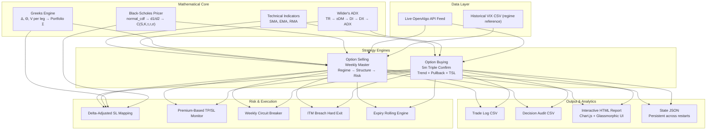

<p align="center">
  
  
  
</p>

<h1 align="center">Nifty Quant Suite</h1>
<p align="center"><b>A professional, rules-based options trading and analytics framework for the NSE Nifty 50 derivative market</b></p>

---

## 💡 Our Trading Philosophy & Passion

Systematic trading is the intersection of software engineering, quantitative finance, and strict risk discipline. The **Nifty Quant Suite** represents a Conviction-driven, rules-based approach to option trading on the Indian derivatives market. 

Options are complex, non-linear instruments. Rather than relying on discretionary "gut feel," our system targets institutional-grade trade automation:
* **Quant-Driven Edge**: Using statistical indicators like Wilder's ADX, India VIX, Put-Call Ratio (PCR), and historical volatility rank to classify market regimes.
* **Capital & Risk Shielding**: Implementing rule-based weekly circuit breakers, delta-adjusted trailing stop losses, and hard ITM breach exits to protect trading capital.
* **Execution Efficiency**: Firing trades at candle boundaries, loading dynamic option chains via API, and deploying multi-leg baskets to optimize slippage and margin usage.

Our core target is to build **steady, repeatable returns** with high Sharpe and Sortino ratios while keeping drawdowns within strict tolerances.

---

## 📅 Core Algorithmic Strategies

The suite unifies two strategies covering opposite ends of the option trading spectrum:

### 1. Strategy 1 — Option Buying: Nifty 5m Triple Confirm
* **Objective**: Directional intraday momentum harvesting.
* **Signals**: A triple-confirmation system consisting of a fast/slow SMA crossover filter, a long-term EMA trend filter, and a minimum trend-distance guard.
* **Execution**: Dynamically selects weekly contracts closest to the ₹200 premium sweet spot to capture high-delta exposure.
* **Risk Management**: Employs a two-phase spot trailing stop loss (initial fixed SL on Spot, shifting to dynamic trailing once profit targets are met).

### 2. Strategy 2 — Option Selling: Nifty Weekly Master
* **Objective**: Regime-adaptive theta harvesting.
* **Signals**: Monitors ADX, IV Rank (IVR), PCR, and VIX to determine if the market is trending, ranging, or in a volatile zone.
* **Execution**: Deploys specific multi-leg setups (Batman Spreads for high-IV range, Wide Iron Condors for mid-IV range, and Capped butterflies/ratio spreads for trending zones).
* **Risk Management**: Employs delta-adjusted stops, hard ITM boundaries, and expiry day rolling adjustments (profit rolls & defensive rolls).

---

## 🏛️ System Architecture



---

## 📁 Project Structure

```
nifty-quant-suite/
│
├── option-buying/                          # Strategy 1: Directional Option Buying
│   ├── option_buying.py                    #   Live trading engine (OpenAlgo SDK)
│   ├── strategy_logic.md                   #   Complete signal & TSL logic document

│
├── option-selling/                         # Strategy 2: Multi-Leg Option Selling
│   ├── nifty_weekly_master.py              #   Live regime-adaptive weekly engine
│   └── README.md                           #   Exhaustive trade rules & decision trees
│
├── dashboard/                              # Unified Portfolio Analytics UI
│   ├── index.html                          #   Glassmorphic dark-mode dashboard
│   ├── style.css                           #   Premium HSL token design system
│   └── app.js                              #   Chart.js visualization engine
│
├── README.md                               # ← You are here
└── requirements.txt                        #   Python dependencies
```

---

## 📊 Performance Snapshots

### Option Buying Strategy

| Metric | Value |
|---|---|
| Gross Option Profit | Rs. +1,161,038 |
| Total Brokerage | Rs. 22,440 |
| Estimated Net PnL | Rs. +1,138,598 |
| Spot Net Profit (Points) | +25,762.1 pts |
| Gross Option ROI | 2322.1 % |
| Avg Monthly Return | Rs. +22,328 |
| Max Drawdown | Rs. 89,902 |
| Sharpe / Sortino | 1.90 / 3.42 |
| Calmar / Martin | 2.94 / 8.78 |
| Total Trades | 374 |
| Win Rate | 50.3 % |

### Option Selling Strategy

| Metric | Value |
|---|---|
| Net P&L | Rs. +1,24,600 |
| Win Rate | 68.2 % (92 wins / 135 slots) |
| Profit Factor | 2.14 |
| Max Drawdown | Rs. 18,400 (9.2 % of capital) |
| Sharpe Ratio | 2.05 |
| Sortino Ratio | 3.12 |
| Calmar Ratio | 4.58 |

---

## 🚀 Getting Started

### Prerequisites
Install Python dependencies:
```bash
pip install -r requirements.txt
```

### Running the Live Strategies
Both strategies require a running instance of the [OpenAlgo API Gateway](https://github.com/marketcalls/openalgo) connected to your broker feed:

```bash
# 1. Running Option Buying Live Engine
cd option-buying
python option_buying.py

# 2. Running Option Selling Live Engine
cd option-selling
python nifty_weekly_master.py
```

### Viewing the Portfolio Analytics Dashboard
Open the interactive UI locally:
1. Navigate to the `dashboard/` directory.
2. Double-click `index.html` to open it in any modern browser. Toggles between Option Buying and Option Selling metrics, heatmaps, and performance charts.

---

<p align="center">
  <sub>Quantitative Developer · Options Trader · Systems Engineer</sub>
</p>
