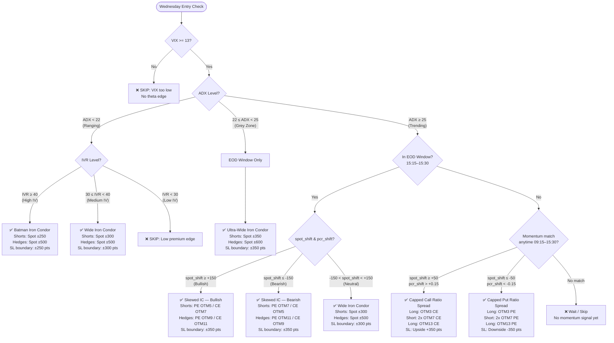
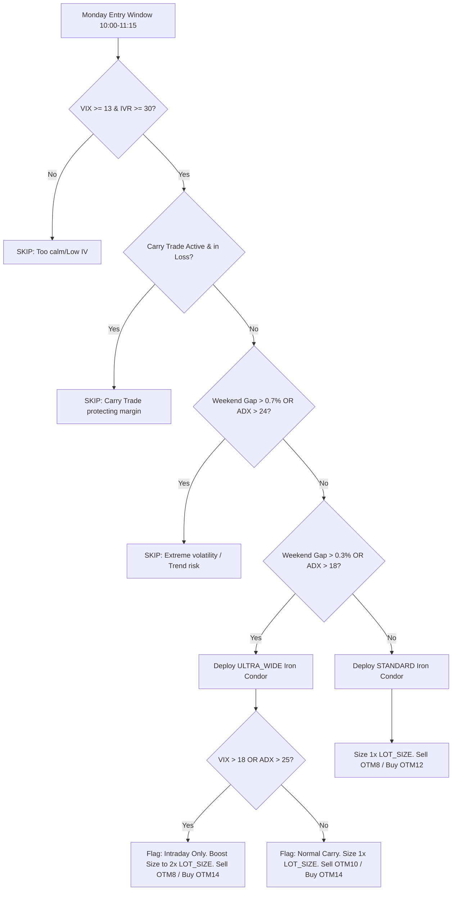
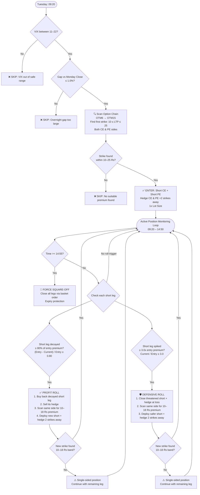

# Nifty Weekly Master Strategy — Strategy Manual & Trade Rules (v2.1 Precision)

This document serves as a simplified, itemized reference for the trading cases, execution gates, and entry/exit conditions implemented in [nifty_weekly_master.py](file:///c:/Users/Kush%20Tejani/Downloads/backtest/nifty-quant-suite/option-selling/nifty_weekly_master.py).

---

## ⚙️ Global Parameters & Configuration

| Parameter | Configuration Value | Description |
| :--- | :--- | :--- |
| **Underlying Instrument** | `NIFTY` | Underlying index name |
| **Exchanges** | `NSE_INDEX` (Index), `NFO` (Derivatives) | OpenAlgo target exchanges |
| **Product Type** | `NRML` | Allows positions to carry forward overnight |
| **Lot Size** | `65` qty | Multiplier per option contract |
| **Strike Step** | `50` points | Nifty strike price interval |
| **Capital Basis** | `Rs. 2,00,000` | Account capital size for risk calculation |
| **Weekly Limit** | `Rs. 4,000` (`2%` of Capital) | Strategy weekly loss cap |
| **Average Weekly Prem**| `Rs. 32,500` (`500 * LOT_SIZE`) | Expected premium collection |
| **Weekly SL Mult** | `3.0x` | Multiplier for the Global Weekly Circuit Breaker |

---

## 🛡️ Global Risk Shields (Runs Every 300s Loop)

The strategy monitors these risk parameters on every loop tick:

### 1. Global Weekly Circuit Breaker
* **Trigger Condition**: Accumulated weekly loss exceeds `3.0x` the average weekly premium:
  `weekly_pnl < -(WEEKLY_SL_MULT * AVG_WEEKLY_PREM) = -Rs. 97,500`
* **Action**:
  1. Squares off all active slots (`carry_trade`, `monday_trade`, `tuesday_trade`) with market orders.
  2. Sets `week_blocked = True` in state.
  3. Halts all strategy entries for the remainder of the week.

### 2. Hard ITM Breach Exit
Active positions are monitored against spot index moves to prevent tail risk:
* **Butterfly / Straddle (Neutral ATM short-based)**:
  * Hard exit if Nifty Spot shifts `>= 50` points away from the entry strike:
    `Spot > strike + 50` OR `Spot < strike - 50`
* **Iron Condor / Batman (OTM short-based)**:
  * Hard exit if Nifty Spot touches or crosses the short strikes:
    `Spot > strike + short_offset` OR `Spot < strike - short_offset`
* **Capped Call Ratio Spread**:
  * Hard exit triggered only on the upside:
    `Spot > strike + short_offset`
* **Capped Put Ratio Spread**:
  * Hard exit triggered only on the downside:
    `Spot < strike - short_offset`

### 3. Premium-Based Stop Loss
* **Carry Trade SL**: Exits if Net PnL drops to `<= -1.5x` of the premium collected credit.
* **Monday Trade SL**: Exits if Net PnL drops to `<= -1.2x` of the premium collected credit.
* **Tuesday Trade SL**: Tuesday trades do not have an automated stop loss; they are managed by rolls or squared off at EOD.
* **Data Lag Safeguard**: If any active contract LTP returns `<= 0`, the premium SL check is skipped for that cycle.
* *Note: Take Profit (TP) auto-exits are disabled to allow for manual profit management.*

---

## 📅 Weekly Strategy Execution Timeline

```mermaid
gantt
    title Nifty Weekly Strategy Matrix
    dateFormat  X
    axisFormat %d
    section Wednesday
    Wednesday Close Recording :active, 0, 10
    Wednesday Carry Entry (EOD & Intra) :active, 5, 10
    section Monday
    Gap Settlement & Entry (10:00-11:15) :active, 20, 25
    Monday Close Recording (15:20-15:25) :active, 29, 30
    section Tuesday
    Expiry IC Entry (09:20-12:00) :active, 35, 45
    Intraday Rolling / Adjustments (All Day) :active, 40, 55
    Force Square-off (14:55) :crit, 55, 56
```

---

## 🟢 Wednesday — Regime-Based Carry Trade (Overnight)

* **Pre-requisite Gate**: India VIX must be `>= 13` (ensures premium volatility edge).
* **Execution Window**: Triggers between `15:15` and `15:30` (EOD) for ranging structures. Trend ratio spreads trigger **anytime** (`09:15` - `15:30`) if momentum is confirmed.
* **Shift Formulas**:
  * `spot_shift = Spot - morning_spot`
  * `pcr_shift = PCR - morning_pcr`

### Wednesday Entry Decision Tree

### Strategy Selection Table

| ADX Trend Regime | VIX / IVR Gate | Momentum trigger | Setup Deployed | Shorts & Hedges Placement | Safety short_offset |
| :--- | :--- | :--- | :--- | :--- | :--- |
| **Ranging** ($\text{ADX} < 22$) | $\text{IVR} \ge 40$ | EOD window | **Batman IC** | Shorts $\pm 250$ pts (OTM5) \| Hedges $\pm 500$ pts (OTM10) | $\pm 250$ pts |
| **Ranging** ($\text{ADX} < 22$) | $30 \le \text{IVR} < 40$ | EOD window | **Wide IC** | Shorts $\pm 300$ pts (OTM6) \| Hedges $\pm 500$ pts (OTM10) | $\pm 300$ pts |
| **Grey Zone** ($22 \le \text{ADX} < 25$) | Any | EOD window | **Ultra-Wide IC** | Shorts $\pm 350$ pts (OTM7) \| Hedges $\pm 600$ pts (OTM12) | $\pm 350$ pts |
| **Trending** ($\text{ADX} \ge 25$) | Any | Spot $+50$ \| PCR $+0.15$ | **Call Ratio Butterfly** | Long OTM3 CE \| 2x Short OTM7 CE \| Long OTM13 CE | $+350$ pts |
| **Trending** ($\text{ADX} \ge 25$) | Any | Spot $-50$ \| PCR $-0.15$ | **Put Ratio Butterfly** | Long OTM3 PE \| 2x Short OTM7 PE \| Long OTM13 PE | $-350$ pts |
| **EOD Skewed Bull** | Any | Spot shift $\ge +150$ | **Skewed IC (Bull)** | Shorts: PE OTM5 / CE OTM7 \| Hedges: PE OTM9 / CE OTM11 | $\pm 350$ pts |
| **EOD Skewed Bear** | Any | Spot shift $\le -150$ | **Skewed IC (Bear)** | Shorts: PE OTM7 / CE OTM5 \| Hedges: PE OTM11 / CE OTM9 | $\pm 350$ pts |

---

## 🔵 Monday — Weekend Gap Player (Adaptive IC)

* **Execution Window**: Enters between `10:00` and `11:15` to let gap volatility settle.
* **Gates**: VIX `>= 13`, IVR `>= 30`, and Carry Trade PnL `>= 0` (if active).
* **Weekend Gap formula**:
  `gap_pct = (|Monday Open - Friday Close| / Friday Close) * 100`

### Monday Decision Rules

---

## 🟡 Tuesday — Expiry Machine (Smart Adaptive IC)

* **Execution Window**: Entry checked between `09:20` and `12:00`.
* **Gates**: $11 \le \text{VIX} \le 22$ and overnight gap vs Monday's Close `<= 1.0%`.

### 1. Smart Entry Selection
* **Search Method**: Scans option strikes from OTM6 outwards to OTM15.
* **Premium Target Band**: Finds the first strike on each side with LTP in this range:
  `10 <= Option Premium <= 25`
* **Hedge Placement**: Placed exactly 2 strikes away (100 points) from chosen shorts.

### 2. Tuesday Full Lifecycle Decision Tree

### 3. Active Expiry Rolling Logic (09:20 - 14:50)

* **Profit Roll (Capture Decay)**:
  * **Trigger**: A short leg value decays by `>= 80%`:
    `(Entry Price - Current Price) / Entry Price >= 0.80`
  * **Action**: Closes that decaying short + hedge, and rolls same-side strike to collect new premium in the **10 Rs to 18 Rs** band.
* **Defensive Roll (Mitigate Threat)**:
  * **Trigger**: A short leg spikes to `>= 3.0x` its entry premium:
    `Current Price / Entry Price >= 3.0`
  * **Action**: Closes the threatened legs at a loss, and rolls same-side strike further away into the safer **10 Rs to 18 Rs** premium band.
* **Expiry Force Square-off**: Closes all remaining legs at `14:55` to avoid overnight delivery risk.

---

## 📊 Position Greeks Tracking

Greeks are dynamically aggregated every cycle using Black-Scholes pricing with a risk-free rate of `6.5%` and VIX volatility:

`Delta_Total = sum(Delta_leg * Multiplier) | Theta_Total = sum(Theta_leg * Multiplier) | Vega_Total = sum(Vega_leg * Multiplier)`

* *Multiplier is positive (+Qty) for long positions and negative (-Qty) for short positions.*
* Values are written to `nifty_master_state.json`.

---

## 📈 Logging Architecture

* **State**: [nifty_master_state.json](file:///c:/Users/Kush%20Tejani/Downloads/backtest/nifty-quant-suite/option-selling/nifty_master_state.json) logs runtime state and Greeks.
* **Audit**: [nifty_master_audit.csv](file:///c:/Users/Kush%20Tejani/Downloads/backtest/nifty-quant-suite/option-selling/nifty_master_audit.csv) stores chronological records of decisions and gates.
* **Journal**: [nifty_master_trades.csv](file:///c:/Users/Kush%20Tejani/Downloads/backtest/nifty-quant-suite/option-selling/nifty_master_trades.csv) registers entries, exits, realized PnLs, and market indicators.